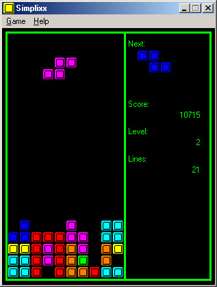



## Simplixx \- A simple Tetris clone\! /w High Scores

### Description

The purpose of this code is to show people how to write simple games of their own. I chose Tetris because it's a rather classic game and relatively easy to program.
 
### More Info
 

             |
---                |---
**Submitted On**   |2005-07-09 13:12:24
**By**             |[Ken A\. Price](https://github.com/Planet-Source-Code/PSCIndex/blob/master/ByAuthor/ken-a-price.md)
**Level**          |Beginner
**User Rating**    |5.0 (20 globes from 4 users)
**Compatibility**  |VB 6\.0
**Category**       |[Games](https://github.com/Planet-Source-Code/PSCIndex/blob/master/ByCategory/games__1-38.md)
**World**          |[Visual Basic](https://github.com/Planet-Source-Code/PSCIndex/blob/master/ByWorld/visual-basic.md)
**Archive File**   |[Simplixx\_\-191141792005\.zip](https://github.com/Planet-Source-Code/ken-a-price-simplixx-a-simple-tetris-clone-w-high-scores__1-61614/archive/master.zip)

